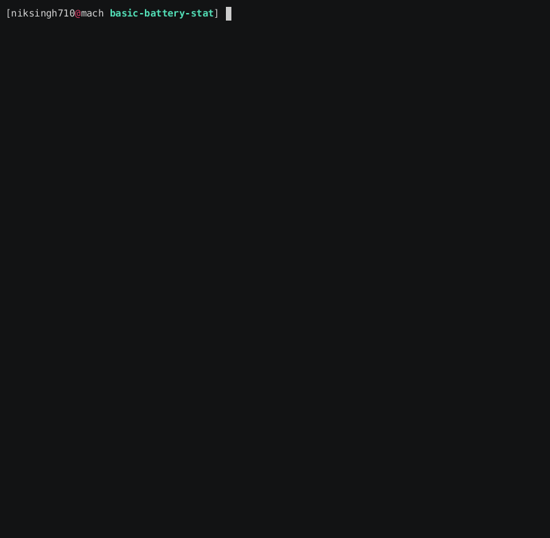

# Basic Battery Stat



This is a simple script utility that shows the basic stats of battery to the user.
If `qdbus` an optional dependency is installed it will fetch data from mobile devices connected to the system via kde connect.

# Installation

```bash
sudo make install
```

# Uninstallation

```bash
sudo make uninstall
```

# Tip

Install `qdbus` and setup kdeconnect to get mobile device data too.

`qt5-tools` are for `qdbus` on Arch Linux.

